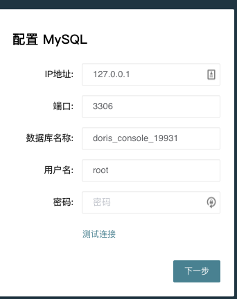
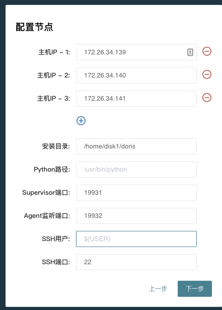
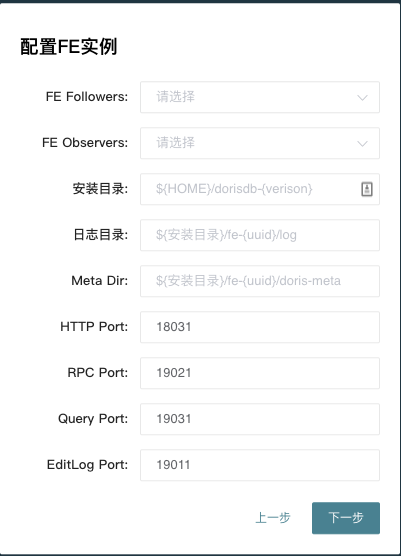
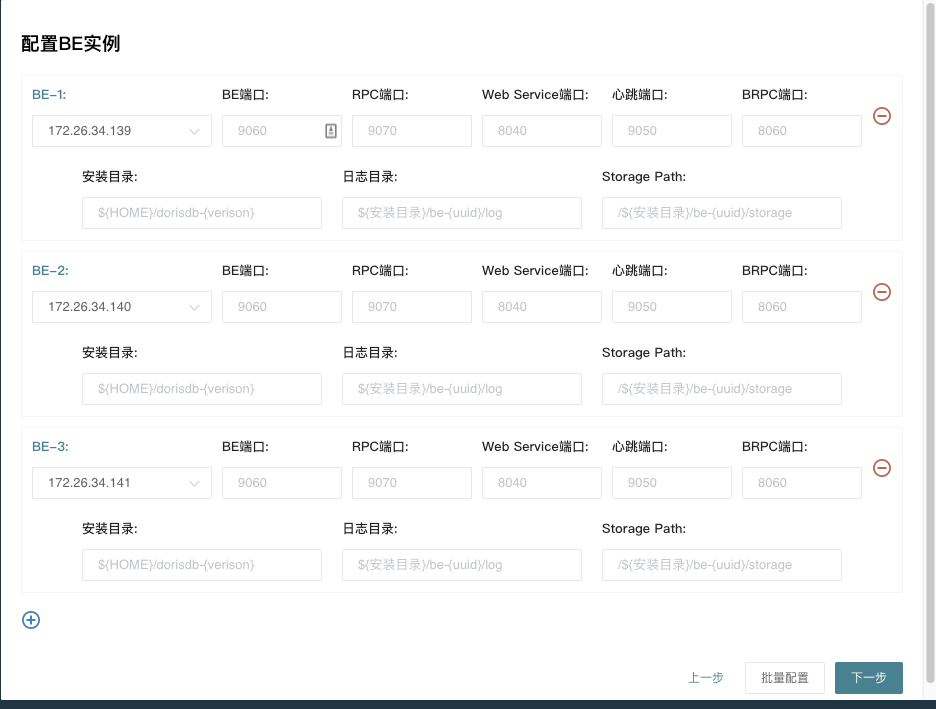
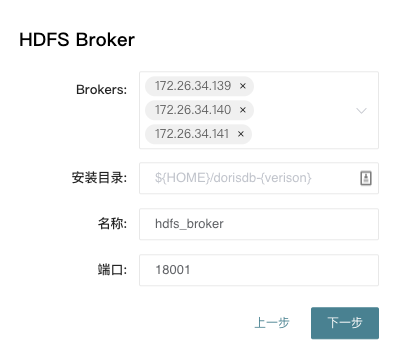
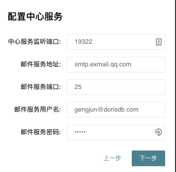

# 集群部署

StarRocks的集群部署分为两种模式，第一种是使用命令部署，第二种是使用 StarRocksManager 自动化部署。自动部署的版本只需要在页面上简单进行配置、选择、输入后批量完成，并且包含Supervisor进程管理、滚动升级、备份、回滚等功能。命令部署的方式适用于希望和自有运维系统打通的用户，有助于管理员理解StarRocks的内部运行机制，直接定位处理一些更复杂的问题。

## StarRocksManager部署

### 安装依赖

在所有需要部署StarRocks的节点上安装以下依赖:

* JDK (1.8 以上)  并且配置好JAVA_HOME (比如 `~/.bashrc` 中增加 `export` ).
* python (2.7 以上)
* python-setuptools (`yum install setuptools or apt-get install setuptools`)

另外StarRocksManager本身需要连接一个MySQL来存储Manager管理平台的数据。

### 安装StarRocksManager部署工具

解压以后

~~~shell
$ bin/install.sh -h
-[d install_path] install_path(default: /home/disk1/starrocks/starrocksdb-manager-20200101)
-[y python_bin_path] python_bin_path(default: /usr/bin/python)
-[p admin_console_port] admin_console_port(default: 19321)
-[s supervisor_http_port] supervisor_http_port(default: 19320)
$ bin/install.sh
~~~

该步骤会安装一个简单的web页面来帮助安装StarRocks数据库

### 安装部署StarRocks

* 首先需要配置一个安装好的MySQL数据库，此MySQL用于存储StarRocksManager的管理、查询、报警等信息

* 选择需要部署的节点，以及agent和supervisor的安装目录，agent负责采集机器的统计信息，Supervisor管理进程的启动停止，所有安装都在用户环境，不会影响系统环境。

* **安装FE**： `meta dir`是StarRocks的元数据目录，和命令安装类似，建议配置一个独立的starrocks-meta和fe的log 目录，FE follower建议配置1或者3个，在请求压力比较大的情况可以酌情增加observer

* **安装BE**： 端口的含义参考下面[端口列表](#端口列表)

* **安装Broker**，建议在所有节点上都安装Broker

* **安装Center service**： center service负责从agent拉取信息后汇总存储在MySQL中，并提供监控报警的服务。这里的邮件服务用来配置接收报警通知的邮箱，可以填空，以后再进行配置。

### 端口列表

|实例名称|端口名称|默认端口|通讯方向|说明|
|---|---|---|---|---|
|BE|be_port|9060|FE&nbsp;&nbsp; --> BE|BE 上 thrift server 的端口， 用于接收来自 FE 的请求|
|BE|webserver_port|8040|BE <--> BE|BE 上的 http server 的端口|
|BE|heartbeat_service_port|9050|FE&nbsp;&nbsp; --> BE|BE 上心跳服务端口（thrift）， 用于接收来自 FE 的心跳|
|BE|brpc_port|8060|FE <--> BE BE <--> BE|BE 上的 brpc 端口， 用于 BE 之间通讯|
|FE|**http_port**|**8030**|FE <--> 用户|FE 上的 http server 端口|
|FE|rpc_port|9020|BE&nbsp;&nbsp; --> FE  FE <--> FE|FE 上的 thrift server 端口|
|FE|**query_port**|**9030**| FE <--> 用户|FE 上的 mysql server 端口|
|FE|edit_log_port|9010|FE <--> FE|FE 上的 bdbje 之间通信端口|
|Broker|broker_ipc_port|8000|FE&nbsp;&nbsp; --> Broker  BE&nbsp;&nbsp; --> Broker|Broker 上的 thrift server， 用于接收请求|

其中 http_port(8030)、query_port(9030) 是常用端口，前者用于网页访问 FE，后者用于 MySQL 客户端访问。

## 手动部署

手动部署参考 [StarRocks手动部署](../quick_start/Deploy.md)。
