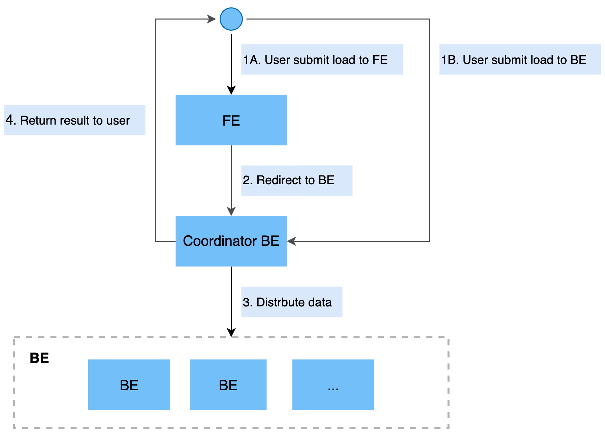

# Stream load

DorisDB支持从本地直接导入数据，支持CSV文件格式。数据量在10GB以下。

Stream Load 是一种同步的导入方式，用户通过发送 HTTP 请求将本地文件或数据流导入到 DorisDB 中。Stream Load 同步执行导入并返回导入结果。用户可直接通过请求的返回值判断导入是否成功。

---

## 名词解释

* **Coordinator**：协调节点。负责接收数据并分发数据到其他数据节点，导入完成后返回结果给用户。

---

## 基本原理

Stream Load 中，用户通过HTTP协议提交导入命令。如果提交到FE节点，则FE节点会通过HTTP redirect指令将请求转发给某一个BE节点，用户也可以直接提交导入命令给某一指定BE节点。该BE节点作为Coordinator节点，将数据按表schema划分并分发数据到相关的BE节点。导入的最终结果由 Coordinator节点返回给用户。

下图展示了Stream Load的主要流程:

---

## 导入示例

### 创建导入任务

Stream Load 通过 HTTP 协议提交和传输数据。这里通过 curl 命令展示如何提交导入。用户也可以通过其他HTTP client进行操作。

**语法：**

~~~bash
curl --location-trusted -u user:passwd [-H ""...] -T data.file -XPUT \
    http://fe_host:http_port/api/{db}/{table}/_stream_load
~~~

Header中支持的属性见下文的导入任务参数说明，格式为: -H "key1:value1"。如果同时有多个任务参数，需要用多个 -H 来指示，类似于 \-H "key1:value1" -H "key2:value2"……

**示例：**

~~~bash
curl --location-trusted -u root -T date -H "label:123" \
    http://abc.com:8030/api/test/date/_stream_load
~~~

创建导入任务的详细语法可执行HELP STREAM LOAD查看，下面介绍该命令中部分参数的意义。

**说明：**

* 当前支持HTTP chunked与非chunked上传两种方式，对于非chunked方式，必须要有Content-Length来标示上传内容长度，这样能够保证数据的完整性。
* 用户最好设置Expect Header字段内容100-continue，这样可以在某些出错场景下避免不必要的数据传输。

**签名参数：**

* user/passwd，Stream Load创建导入任务使用的是HTTP协议，可通过 Basic access authentication 进行签名。DorisDB 系统会根据签名来验证用户身份和导入权限。

**导入任务参数：**

Stream Load 中所有与导入任务相关的参数均设置在 Header 中。下面介绍其中部分参数的意义：

* **label** :导入任务的标签，相同标签的数据无法多次导入。用户可以通过指定Label的方式来避免一份数据重复导入的问题。当前DorisDB系统会保留最近30分钟内成功完成的任务的Label。
* **column-separator** ：用于指定导入文件中的列分隔符，默认为\\t。如果是不可见字符，则需要加\\x作为前缀，使用十六进制来表示分隔符。如Hive文件的分隔符\\x01，需要指定为\-H "column-separator:\\x01"
* **row-delimiter**: 用户指定导入文件中的行分隔符，默认为\\n。
* **columns** ：用于指定导入文件中的列和 table 中的列的对应关系。如果源文件中的列正好对应表中的内容，那么无需指定该参数。如果源文件与表schema不对应，那么需要这个参数来配置数据转换规则。这里有两种形式的列，一种是直接对应于导入文件中的字段，可直接使用字段名表示；一种需要通过计算得出。举几个例子帮助理解：

  * 例1：表中有3列"c1, c2, c3"，源文件中的3列依次对应的是"c3,c2,c1"; 那么需要指定\-H "columns: c3, c2, c1"
  * 例2：表中有3列"c1, c2, c3" ，源文件中前3列一一对应，但是还有多余1列；那么需要指定\-H "columns: c1, c2, c3, temp"，最后1列随意指定名称用于占位即可。
  * 例3：表中有3个列“year, month, day"，源文件中只有一个时间列，为”2018-06-01 01:02:03“格式；那么可以指定 \-H "columns: col, year = year(col), month=month(col), day=day(col)"完成导入。

* **where**: 用于抽取部分数据。用户如需将不需要的数据过滤掉，那么可以通过设定这个选项来达到。

  * 例1：只导入k1列等于20180601的数据，那么可以在导入时指定\-H "where: k1 = 20180601"。

* **max-filter-ratio**：最大容忍可过滤（数据不规范等原因而过滤）的数据比例。默认零容忍。数据不规范不包括通过 where 条件过滤掉的行。
* **partitions**: 用于指定这次导入所涉及的partition。如果用户能够确定数据对应的partition，推荐指定该项。不满足这些分区的数据将被过滤掉。比如指定导入到p1、p2分区：\-H "partitions: p1, p2"。
* **timeout**: 指定导入的超时时间。单位秒，默认是 600 秒。可设置范围为 1 秒 ~ 259200 秒。
* **strict-mode**: 用户指定此次导入是否开启严格模式，默认为开启。关闭方式为：\-H "strict-mode: false"。
* **timezone**: 指定本次导入所使用的时区。默认为东八区。该参数会影响所有导入涉及的和时区有关的函数结果。
* **exec-mem-limit**: 导入内存限制。默认为 2GB。单位是「字节」。

**返回结果：**

导入完成后，Stream Load会以Json格式返回这次导入的相关内容，示例如下：

~~~json
{

"TxnId": 1003,

"Label": "b6f3bc78-0d2c-45d9-9e4c-faa0a0149bee",

"Status": "Success",

"ExistingJobStatus": "FINISHED", // optional

"Message": "OK",

"NumberTotalRows": 1000000,

"NumberLoadedRows": 1000000,

"NumberFilteredRows": 1,

"NumberUnselectedRows": 0,

"LoadBytes": 40888898,

"LoadTimeMs": 2144,

"ErrorURL": "[http://192.168.1.1:8042/api/_load_error_log?file=__shard_0/error_log_insert_stmt_db18266d4d9b4ee5-abb00ddd64bdf005_db18266d4d9b4ee5_abb00ddd64bdf005](http://192.168.1.1:8042/api/_load_error_log?file=__shard_0/error_log_insert_stmt_db18266d4d9b4ee5-abb00ddd64bdf005_db18266d4d9b4ee5_abb00ddd64bdf005)"

}
~~~

* TxnId：导入的事务ID。用户可不感知。
  
* Status: 导入最后的状态。

* Success：表示导入成功，数据已经可见。
* Publish Timeout：表述导入作业已经成功Commit，但是由于某种原因并不能立即可见。用户可以视作已经成功不必重试导入。
* Label Already Exists：表明该Label已经被其他作业占用，可能是导入成功，也可能是正在导入。
* 其他：此次导入失败，用户可以指定Label重试此次作业。

* Message: 导入状态的详细说明。失败时会返回具体的失败原因。
* NumberTotalRows: 从数据流中读取到的总行数。
* NumberLoadedRows: 此次导入的数据行数，只有在Success时有效。
* NumberFilteredRows: 此次导入过滤掉的行数，即数据质量不合格的行。
* NumberUnselectedRows: 此次导入，通过 where 条件被过滤掉的行数。
* LoadBytes: 此次导入的源文件数据量大小。
* LoadTimeMs: 此次导入所用的时间(ms)。
* ErrorURL: 被过滤数据的具体内容，仅保留前1000条。如果导入任务失败，可以直接用以下方式获取被过滤的数据，并进行分析，以调整导入任务。

  * ~~~bash
    wget http://192.168.1.1:8042/api/_load_error_log?file=__shard_0/error_log_insert_stmt_db18266d4d9b4ee5-abb00ddd64bdf005_db18266d4d9b4ee5_abb00ddd64bdf005
    ~~~

### 取消导入

用户无法手动取消 Stream Load，Stream Load 在超时或者导入错误后会被系统自动取消。

---

## 最佳实践

### 应用场景

Stream Load 的最佳使用场景是原始文件在内存中或者存储在本地磁盘中。其次由于 Stream Load 是一种同步的导入方式，所以用户如果希望用同步方式获取导入结果，也可以使用这种导入。

### 数据量

由于Stream Load是由BE发起的导入并分发数据，建议的导入数据量在 1GB 到 10GB 之间。系统默认的最大Stream Load导入数据量为10GB，所以如果要导入超过10GB的文件需要修改BE的配置项streaming-load-max-mb。比如，待导入文件大小为15G，则修改BE配置 streaming-load-max-mb 为 16000 即可。

Stream Load的默认超时为300秒，按照DorisDB目前最大的导入限速来看，导入超过3GB大小的文件就需要修改导入任务默认的超时时间了。

导入任务超时时间 = 导入数据量 / 10M/s （具体的平均导入速度需要用户根据自己的集群情况计算）

例如：导入一个 10GB 的文件，timeout应该设为1000s。

### 完整例子

**数据情况**：数据在客户端本地磁盘路径 /home/store-sales 中，导入的数据量约为 15GB，希望导入到数据库 bj-sales 的表 store-sales 中。

**集群情况**：Stream Load 的并发数不受集群大小影响。

* step1: 导入文件大小超过默认的最大导入大小10GB，所以要修改BE的配置文件BE.conf：

`streaming_load_max_mb = 16000`

* step2: 计算大概的导入时间是否超过默认 timeout 值，导入时间 ≈ 15000 / 10 = 1500s，超过了默认的 timeout 时间，需要修改 FE 的配置FE.conf：

`stream_load_default_timeout_second = 1500`

* step3：创建导入任务

~~~bash
curl --location-trusted -u user:password -T /home/store_sales \
    -H "label:abc" [http://abc.com:8000/api/bj_sales/store_sales/_stream_load](http://abc.com:8000/api/bj_sales/store_sales/_stream_load)
~~~

### 代码集成示例

* JAVA开发stream load，参考：[https://github.com/DorisDB/demo/MiscDemo/stream_load](https://github.com/DorisDB/demo/tree/master/MiscDemo/stream_load)
* Spark 集成stream load，参考： [01_sparkStreaming2DorisDB](https://github.com/DorisDB/demo/blob/master/docs/cn/01_sparkStreaming2DorisDB.md)

---

## 常见问题

* 数据质量问题报错：ETL-QUALITY-UNSATISFIED; msg:quality not good enough to cancel

可参考章节导入总览/常见问题。

* Label Already Exists

可参考章节导入总览/常见问题。由于 Stream Load 是采用 HTTP 协议提交创建导入任务，一般各个语言的 HTTP Client 均会自带请求重试逻辑。DorisDB 系统在接受到第一个请求后，已经开始操作 Stream Load，但是由于没有及时向 Client 端返回结果，Client 端会发生再次重试创建请求的情况。这时候 DorisDB 系统由于已经在操作第一个请求，所以第二个请求会遇到 Label Already Exists 的情况。排查上述可能的方法：使用 Label 搜索 FE Master 的日志，看是否存在同一个 Label 出现了两次的情况。如果有就说明Client端重复提交了该请求。

建议用户根据当前请求的数据量，计算出大致的导入耗时，并根据导入超时时间改大 Client 端的请求超时时间，避免请求被 Client 端多次提交。
