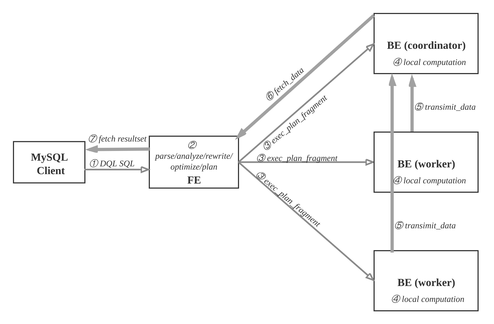
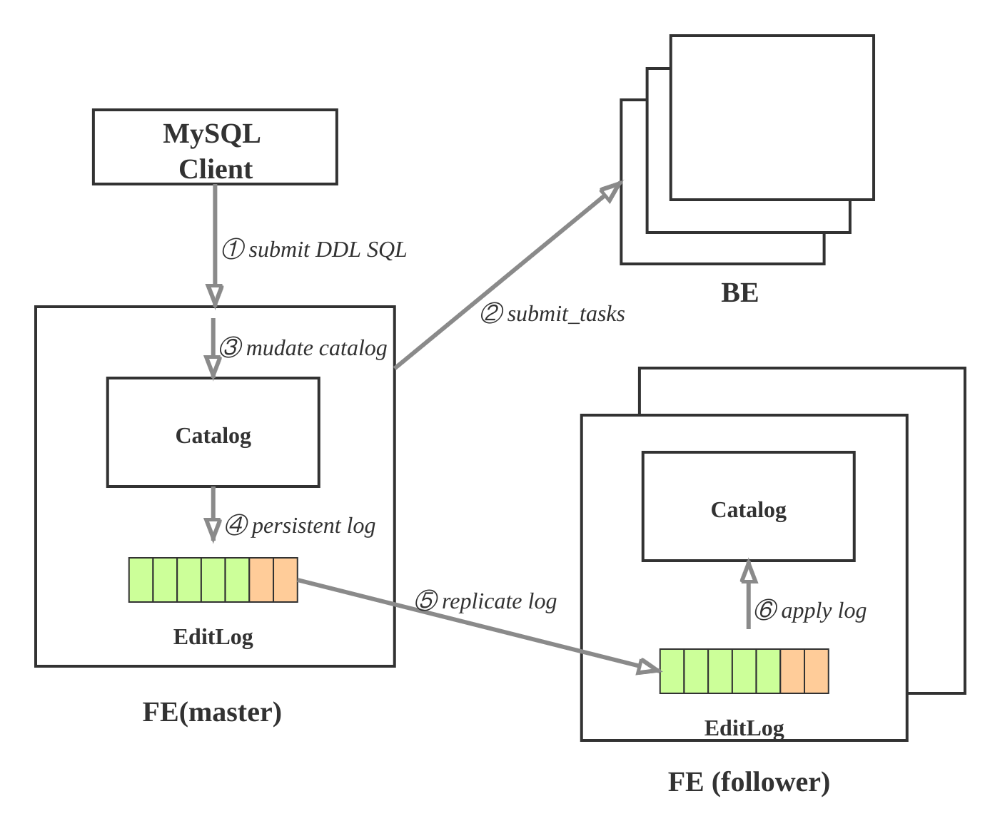

# 数据流和控制流

## 查询

用户可使用MySQL客户端连接FE，执行SQL查询， 获得结果。

查询流程如下：

* MySQL客户端执行DQL SQL命令。
* FE解析, 分析, 改写, 优化和规划, 生成分布式执行计划。
* 分布式执行计划由 若干个可在单台be上执行的plan fragment构成，FE执行exec\_plan\_fragment, 将plan fragment分发给BE，并指定其中一台BE为coordinator。
* BE执行本地计算, 比如扫描数据。
* 其他BE调用transimit\_data将中间结果发送给BE coordinator节点汇总为最终结果。
* FE调用fetch\_data获取最终结果。
* FE将最终结果发送给MySQL client。

执行计划在BE上的实际执行过程比较复杂, 采用向量化执行方式，比如一个算子产生4096个结果，输出到下一个算子参与计算，而非batch方式或者one-tuple-at-a-time。

## 数据导入

用户创建表之后, 导入数据填充表.

* 支持导入数据源有: 本地文件, HDFS, Kafka和S3.
* 支持导入方式有: 批量导入, 流式导入, 实时导入.
* 支持的数据格式有: CSV, Parquet, ORC等.
* 导入发起方式有: 用RESTful接口, 执行SQL命令.

数据导入的流程如下:

* 用户选择一台BE作为协调者, 发起数据导入请求, 传入数据格式, 数据源和标识此次数据导入的label, label用于避免数据重复导入. 用户也可以向FE发起请求, FE会把请求重定向给BE.
* BE收到请求后, 向FE master节点上报, 执行loadTxnBegin, 创建全局事务。 因为导入过程中, 需要同时更新base表和物化索引的多个bucket, 为了保证数据导入的一致性, 用事务控制本次导入的原子性.
* BE创建事务成功后, 执行streamLoadPut调用, 从FE获得本次数据导入的计划. 数据导入, 可以看成是将数据分发到所涉及的全部的tablet副本上, BE从FE获取的导入计划包含数据的schema信息和tablet副本信息.
* BE从数据源拉取数据, 根据base表和物化索引表的schema信息, 构造内部数据格式.
* BE根据分区分桶的规则和副本位置信息, 将发往同一个BE的数据, 批量打包, 发送给BE, BE收到数据后, 将数据写入到对应的tablet副本中.
* 当BE coordinator节点完成此次数据导入, 向FE master节点执行loadTxnCommit, 提交全局事务, 发送本次数据导入的 执行情况, FE master确认所有涉及的tablet的多数副本都成功完成, 则发布本次数据导入使数据对外可见, 否则, 导入失败, 数据不可见, 后台负责清理掉不一致的数据.

## 更改元数据

更改元数据的操作有: 创建数据库, 创建表, 创建物化视图, 修改schema等等. 这样的操作需要:

* 持久化到永久存储的设备上;
* 保证高可用, 复制FE多实例上, 避免单点故障;
* 有的操作需要在BE上生效, 比如创建表时, 需要在BE上创建tablet副本.

元数据的更新操作流程如下:

* 用户使用MySQL client执行SQL的DDL命令, 向FE的master节点发起请求; 比如: 创建表.
* FE检查请求合法性, 然后向BE发起同步命令, 使操作在BE上生效; 比如: FE确定表的列类型是否合法, 计算tablet的副本的放置位置, 向BE发起请求, 创建tablet副本.
* BE执行成功, 则修改内存的Catalog. 比如: 将table, partition, index, tablet的副本信息保存在Catalog中.
* FE追加本次操作到EditLog并且持久化.
* FE通过复制协议将EditLog的新增操作项同步到FE的follower节点.
* FE的follower节点收到新追加的操作项后, 在自己的Catalog上按顺序播放, 使得自己状态追上FE master节点.

上述执行环节出现失败, 则本次元数据修改失败.

