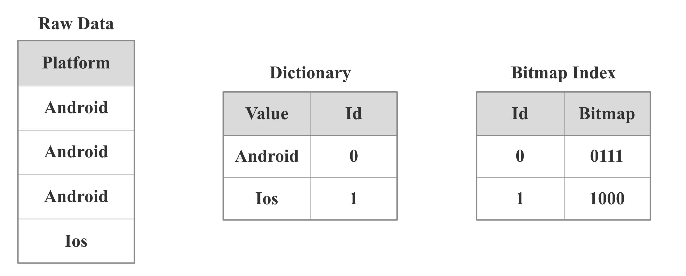

# Bitmap 索引

DorisDB 支持基于Bitmap索引，对于有Filter的查询有明显的加速效果。

## 原理

### **1 什么是Bitmap**

Bitmap是元素为1个bit的, 取值为0,1两种情形的, 可对某一位bit进行置位(set)和清零(clear)操作的数组. Bitmap的使用场景有:

* 用两个long型表示16学生的性别, 0表示女生, 1表示男生.
* 用bitmap表示一组数据中是否存在null值, 0表示元素不为null, 1表示为null.
* 一组数据的取值为(Q1, Q2, Q3, Q4), 表示季度; 用bitmap表示这组数据中取值为Q4的元素; 1表示取值为Q4的元素, 0表示其他取值的元素.

### **2 什么是 Bitmap索引**

Bitmap只能表示取值为两种情形的列数组, 当列的取值为多种取值情形枚举类型时, 例如季度(Q1, Q2, Q3, Q4),  系统平台(Linux, Windows, FreeBSD, MacOS), 则无法用一个Bitmap编码; 此时可以为每个取值各自建立一个Bitmap的来表示这组数据; 同时为实际枚举取值建立词典.

如上图所示，Platform列有4行数据，可能的取值有Android、Ios。DorisDB中会首先针对Platform列构建一个字典，将Android和Ios映射为int，然后就可以对Android和Ios分别构建Bitmap。具体来说，我们分别将Android、Ios 编码为0和1，因为Android出现在第1，2，3行，所以Bitmap是0111，因为Ios出现在第4行，所以Bitmap是1000。

假如有一个针对包含该Platform列的表的SQL查询，select xxx from table where Platform = iOS，DorisDB会首先查找字典，找出iOS对于的编码值是1，然后再去查找 Bitmap Index，知道1对应的Bitmap是1000，我们就知道只有第4行数据符合查询条件，DorisDB就会只读取第4行数据，不会读取所有数据。

## 适用场景

### **1 非前缀过滤**

DorisDB对于建表中的前置列可以通过shortkey索引快速过滤，但是对于非前置列, 无法利用shortkey索引快速过滤，如果需要对非前置列进行快速过滤，就可以对这些列建立Bitmap索引。

### **2 多列过滤Filter**

由于Bitmap可以快速的进行bitwise运算。所以在多列过滤的场景中，也可以考虑对每列分别建立Bitmap索引。

## 如何使用

### **1 创建索引**

在 table1 上为site\_id 列创建 Bitmap 索引：

~~~ SQL
CREATE INDEX index_name ON table1 (site_id) USING BITMAP COMMENT 'balabala';
~~~

### **2 查看索引**

展示指定 table\_name 的下索引：

~~~ SQL
SHOW INDEX FROM example_db.table_name;
~~~

### **3 删除索引**

下面语句可以从一个表中删除指定名称的索引：

~~~ SQL
DROP INDEX index_name ON [db_name.]table_name;
~~~

## 注意事项

1. 对于明细模型，所有列都可以建Bitmap 索引；对于聚合模型，只有Key列可以建Bitmap 索引。
2. Bitmap索引, 应该在取值为枚举型, 取值大量重复, 较低基数, 并且用作等值条件查询或者可转化为等值条件查询的列上创建.
3. 不支持对Float、Double、Decimal 类型的列建Bitmap 索引。
4. 如果要查看某个查询是否命中了Bitmap索引，可以通过查询的Profile信息查看（TODO：加上查看Profile的链接）。
